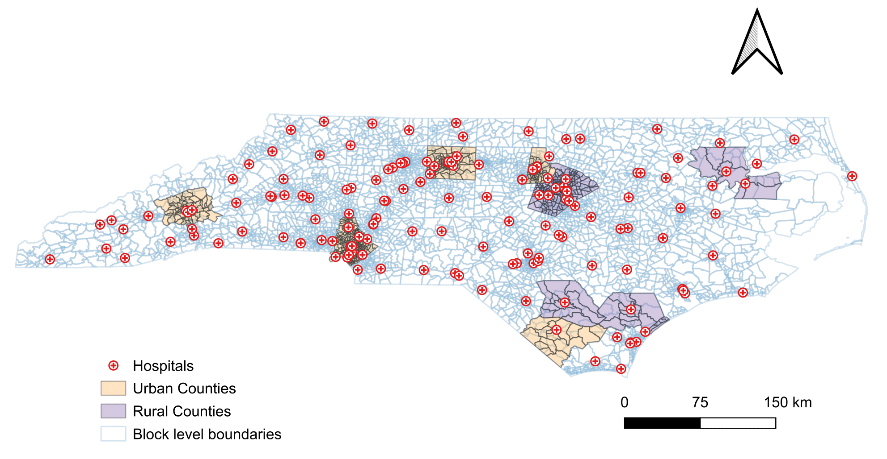
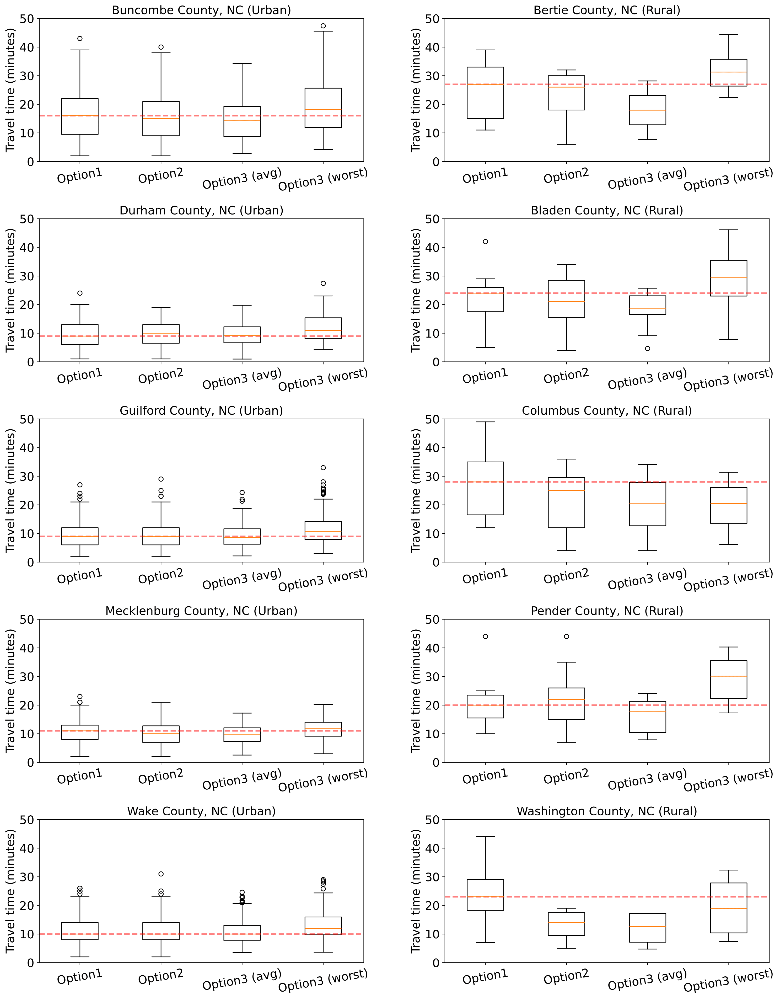

# Healthcare Accessibility Analysis: Macro vs. Micro-Level Measures

This repository contains code for comparing macro-level and micro-level measures of healthcare accessibility in rural and urban areas. The methodology evaluates travel times to hospitals using three spatial resolutions to quantify how measurement granularity affects accessibility assessments.

## 📄 Publication

**Paper:** Gulati, K., Pandey, V., Manikkavasagam, N., Reginato Junior, A., Lidbe, A., & Nagarajan, S. (2025). Comparative Analysis of Macro- and Micro-Level Measures of Healthcare Access in Urban and Rural Areas. *Transportation Research Record*. 

**DOI:** [10.1177/03611981251380266](https://doi.org/10.1177/03611981251380266)

**Paper Link:** [https://journals.sagepub.com/doi/abs/10.1177/03611981251380266](https://journals.sagepub.com/doi/abs/10.1177/03611981251380266)


## 🗺️ Study Counties

### Rural Counties:
- Bertie
- Bladen
- Columbus
- Pender
- Washington

### Urban Counties:
- Buncombe (Asheville)
- Durham
- Guilford (Greensboro)
- Mecklenburg (Charlotte)
- Wake (Raleigh)


## 📚 Documentation

Before running the code, please review:

- **[Installation.md](Installation.md)** - System dependencies, Python packages, and installation troubleshooting
- **[Data_sources.md](Data_sources.md)** - Required datasets, download links, and folder structure setup

---

## 🎯 Methodology Overview

This analysis compares three spatial resolution approaches:

- **Option 1 (Macro-level):** Census tract centroids as origin points
- **Option 2 (Intermediate):** Average coordinates of residential parcels per census tract
- **Option 3 (Micro-level):** Individual residential parcel centroids as origin points


Each option calculates travel times to hospitals, revealing how spatial aggregation affects accessibility measurements.

## 🔧 Usage Instructions

All required data and installation steps are documented in [Installation.md](Installation.md) and [Data_sources.md](Data_sources.md). Ensure you have completed those steps before proceeding.

### Step 1: Prepare Spatial Data

First, create the county folder and add parcel data:
```bash
mkdir -p county_data/Bladen
# Place parcel shapefile in county_data/Bladen/
```

Run spatial preprocessing to generate input CSVs:
```bash
python src/geopandas_analysis.py --county_name Bladen --state_name NorthCarolina
```

**Note:** If the script fails, you need to add residential parcel filtering logic for your county:
1. Open `src/geopandas_analysis.py`
2. Add an `elif` block around line 85 with appropriate `PARUSEDESC` values for your county
3. Run the script again

**Outputs:**
- `Option1_county_centroids.csv` - Census tract centroids
- `Option2_county_centroids.csv` - Average parcel coordinates per tract
- `Option3_residential_parcel_centroids.csv` - Individual parcel centroids
- `hospitals_within_buffer.csv` - Hospitals within 40 miles

### Step 2: Calculate Travel Times

Compute travel times for all three options using r5py:

```bash
# Option 1: Census tract centroids
python src/travel_time_analysis.py --county_name Bladen --state_name NorthCarolina --option 1 --osm NorthCarolina

# Option 2: Average parcel coordinates
python src/travel_time_analysis.py --county_name Bladen --state_name NorthCarolina --option 2 --osm NorthCarolina

# Option 3: Individual parcel centroids (may take longer)
python src/travel_time_analysis.py --county_name Bladen --state_name NorthCarolina --option 3 --osm NorthCarolina
```

**Note:** First run loads OSM network (~200 seconds). Subsequent runs are faster.

**Outputs:**
- `Option{X}_travel_times_{N}locations_to_{M}hospitals_{timestamp}.csv` - Raw travel times
- `Option{X}_aggregated_information_{N}locations_to_{M}hospitals_{timestamp}.csv` - Aggregated statistics

### Step 3: Aggregate and Process Results

Merge travel time results and calculate worst-case scenarios:

```bash
python src/file_evaluator.py --county_name Bladen
```

**Outputs:**
- `customized_combined_output_BEFORE.csv` - After merging, before worst-case analysis
- `customized_combined_output.csv` - Final dataset with all statistics

### Step 4: Generate Visualizations

**Option A: Single-county histograms**
```bash
python src/plot_histogram.py --county_name Guilford --file_name Option3_aggregated_information_181706locations_to_17hospitals__1720014810
```

**Outputs:**
- `Option{X}_histogram_min_travel_time.pdf`
- `Option{X}_histogram_median_travel_time.pdf`

**Option B: Multi-county comparison (Figure 7)**

First, ensure you have processed all 10 counties. Then:

```bash
python src/plot_comparison_county.py
```

**Outputs:**
- `combined_counties_box_plots_fixed_scale.pdf` - Figure 7 from the paper
- Box plots comparing Options 1, 2, 3(avg), 3(worst) across counties

## 📈 Expected Results

The analysis will show:
- **Urban counties:** Minimal differences between Options 1, 2, and 3 (~1-2 minutes)
- **Rural counties:** Significant discrepancies of 10-15 minutes in non-compact census tracts
- **Worst-case scenarios:** Higher travel times for households without vehicles (vulnerable populations)




## 🛠️ Troubleshooting

### Running the Scripts:

**1. Parcel filtering fails:**
- Check unique values in your parcel data: `points['PARUSEDESC'].unique()`
- Add county-specific filtering logic in `geopandas_analysis.py` around line 85
- Each county has different residential parcel codes

**2. File not found errors:**
- Verify your folder structure matches the expected paths in [Data_sources.md](Data_sources.md)
- Ensure all shapefiles include `.shp`, `.shx`, `.dbf`, `.prj` files

**3. Script runs slowly:**
- First run of `travel_time_analysis.py` loads OSM network (~200 seconds)
- Option 3 processes more origin points and takes longer
- Consider starting with Options 1 and 2 first

For installation and dependency issues, see [Installation.md](Installation.md).

## 📝 Citation

If you use this code or methodology, please cite:

### APA Format:
```
Gulati, K., Pandey, V., Manikkavasagam, N., Reginato Junior, A., Lidbe, A., & Nagarajan, S. (2025). Comparative analysis of macro- and micro-level measures of healthcare access in urban and rural areas. Transportation Research Record. https://doi.org/10.1177/03611981251380266
```

### BibTeX Format:
```bibtex
@article{gulati2025comparative,
  title={Comparative Analysis of Macro- and Micro-Level Measures of Healthcare Access in Urban and Rural Areas},
  author={Gulati, Komal and Pandey, Venktesh and Manikkavasagam, Nithish and Reginato Junior, Attilio and Lidbe, Abhay and Nagarajan, Sudhagar},
  journal={Transportation Research Record},
  pages={1--16},
  year={2025},
  publisher={SAGE Publications},
  doi={10.1177/03611981251380266}
}
```

### Software Citation:
This code uses r5py for routing calculations:
```
Fink, C., W. Klumpenhouwer, M. Saraiva, R. Pereira, and H. Tenkanen. (2022). 
r5py: Rapid Realistic Routing with R5 in Python. 
Version 0.0.4. https://github.com/r5py/r5py. https://doi.org/10.5281/zenodo.7060438
```

## 👥 Contact

### Lead Author:
**Komal Gulati**  
PhD Student, Electrical and Computer Engineering  
North Carolina A&T State University  
📧 Email: [kgulati@aggies.ncat.edu](mailto:kgulati@aggies.ncat.edu)  
🔗 LinkedIn: [https://www.linkedin.com/in/komal-gulati/](https://www.linkedin.com/in/komal-gulati/)

### Principal Investigator:
**Dr. Venktesh Pandey**  
Assistant Professor, Civil, Architectural, and Environmental Engineering  
North Carolina A&T State University  
📧 Email: [vpandey@ncat.edu](mailto:vpandey@ncat.edu)  
🔗 LinkedIn: [https://www.linkedin.com/in/venktesh-pandey-95669782/](https://www.linkedin.com/in/venktesh-pandey-95669782/)

### Research Group:
**Transportation Modeling Lab at NC A&T**  
🌐 Website: [https://venktesh22.github.io](https://venktesh22.github.io)  
🏛️ Organization: [https://github.com/tml-ncat](https://github.com/tml-ncat)

## License

This project is licensed under the MIT License - see the [LICENSE](LICENSE) file for details.

## Acknowledgments

This research was funded by the U.S. Department of Transportation through the Center for Regional and Rural Connected Communities (CR2C2) (Grant No. 69A3552348304). Partial support for Dr. Pandey was provided by the National Science Foundation (NSF) (Grant Nos. 2106989 and 2200590).

## 🔗 Related Resources

- **Paper (Open Access):** [Transportation Research Record](https://journals.sagepub.com/doi/abs/10.1177/03611981251380266)
- **r5py Documentation:** [https://r5py.readthedocs.io/](https://r5py.readthedocs.io/)
- **CDC SVI Data:** [https://www.atsdr.cdc.gov/placeandhealth/svi/](https://www.atsdr.cdc.gov/placeandhealth/svi/)
- **North Carolina OneMap:** [https://www.nconemap.gov/](https://www.nconemap.gov/)
- **Geofabrik OSM Downloads:** [https://download.geofabrik.de/](https://download.geofabrik.de/)

---

**Keywords:** healthcare accessibility, transportation barriers, disaggregate data, census tract compactness, micro-level measures, spatial analysis, rural health, urban planning, r5py, geospatial analysis
